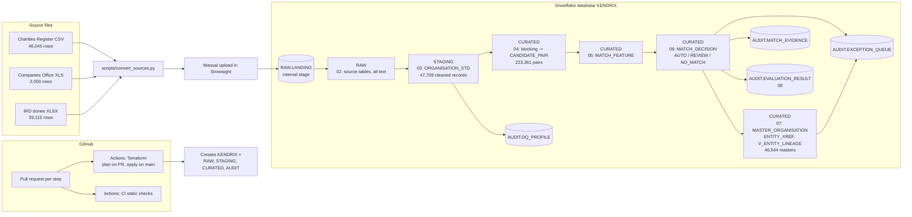
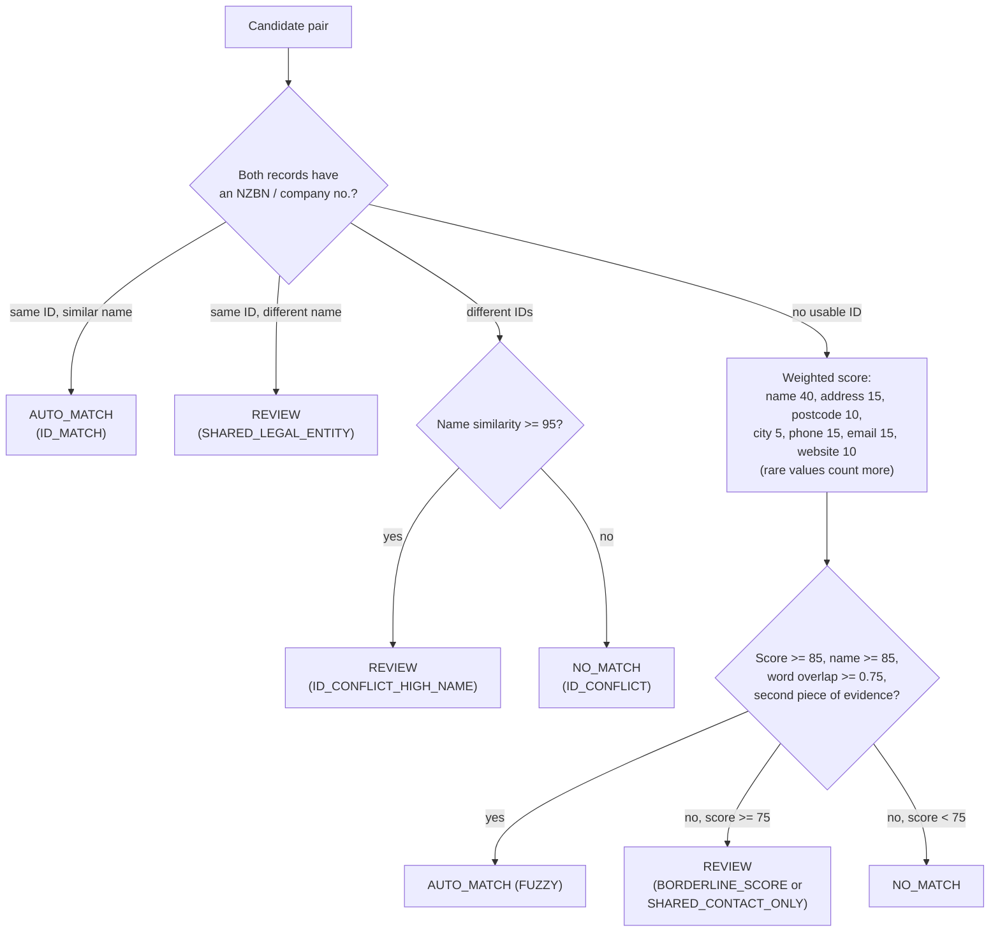

# Architecture

Everything runs in one Snowflake database, `KENDRIX`, as plain numbered SQL files. Each step has a test suite. GitHub holds the code, and GitHub Actions runs Terraform (infrastructure) and static CI checks.

## End-to-end flow

## Layers

| Schema | Holds | Created by |
|---|---|---|
| RAW | Source rows as received (all text), plus file name and load time | `sql/02_raw_tables.sql` |
| STAGING | One cleaned row per organisation record, plus the cleaning UDFs | `sql/03_standardisation.sql` |
| CURATED | Blocking keys, candidate pairs, features, decisions, master records, lineage view | `sql/04` to `sql/08` |
| AUDIT | Run log, evidence per decision, human review queue, data-quality profile, evaluation metrics | `sql/01`, `06`, `07`, `08`, `sql/profiling/` |

Terraform creates only the database and the four schemas. Everything inside them comes from the SQL files, so the SQL can be re-run on its own.

## How one pair is decided (sql/06)

Every decision writes its reasons to `AUDIT.MATCH_EVIDENCE`, and every REVIEW goes to `AUDIT.EXCEPTION_QUEUE`. An ID shared by more than 3 records is treated as a parent or umbrella ID, not an identity.

## From pairs to master records (sql/07)

1. Only AUTO_MATCH pairs link records. Linked records form a cluster (label propagation).
2. Each cluster becomes one row in `MASTER_ORGANISATION`, and the best value for each field is chosen by fixed rules.
3. `ENTITY_XREF` maps every source record to its master. `V_ENTITY_LINEAGE` shows the original RAW row behind each one.
4. If a chain of matches joins records with different NZBNs, the cluster is flagged and every member goes to the queue as `CHAIN_NZBN_CONFLICT`.

## Design choices

- **Plain SQL in Snowflake, not dbt or Python.** Simple to review, run and explain; every rule is visible.
- **Internal stage, not S3.** No cloud storage integration was needed for a prototype. S3 is on the roadmap.
- **Transparent weighted score, not ML.** Weights and thresholds are variables at the top of `sql/06_matching.sql`, so a regulator can see why each pair matched.
- **Human in the loop.** Uncertain pairs are queued with a reason code, not guessed.
